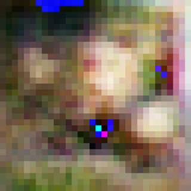
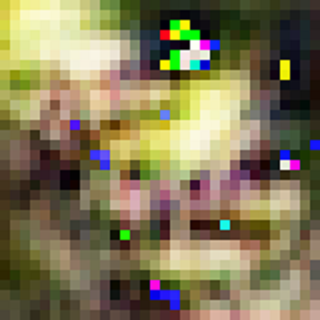

# factorised-image-generation
A collection of GANs demonstrating the efficiency of factorised transposed convolution (deconvolution) layers - performance is comparable to conventional model architectures, with ~25-35% less parameters.

## Context
The Inception architecture and variants such as Xception have been used in image classification tasks with great success - successive versions Inception v2 and v3 have improved on the naive implementation by factorising larger convolutions such as 5x5 to two 3x3 convolution operations as well as by factorising operations of the form NxN to two operations 1xN and Nx1, reducing the amount of needed parameters whilst maintaining a similarly high ability to recognise patterns in input images.

In this repository, this concept of factorising convolutional layers is applied in reverse to transposed convolution layers; an identical copy of the model without factorised layers is also present within each folder for easy comparison of the two. The factorised models contain around 25-35% less parameters, but perform (subjectively) as well as their naive counterparts.

## Examples
 

## Code
The [MNIST model code](https://www.tensorflow.org/tutorials/generative/dcgan) is from the TensorFlow Deep Convolutional Generative Adversarial Network guide.

The [CIFAR-10 model code](https://colab.research.google.com/github/fchollet/deep-learning-with-python-notebooks/blob/master/chapter12_part05_gans.ipynb) is from Deep Learning with Python, by Francois Chollet.

## Datasets
The datasets used in this repository are:
- MNIST database of handwritten images
- CIFAR-10
