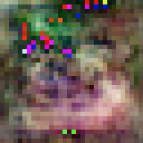
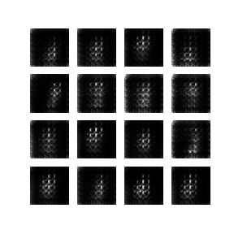

# factorised-image-generation
A collection of GANs demonstrating the efficiency of factorised transposed convolution (deconvolution) layers - performance is comparable to conventional model architectures, but with ~15-40% less parameters.

## Context
The Inception architecture and variants such as Xception have been used in image classification tasks with great success - successive versions Inception v2 and v3 have improved on the naive implementation by factorising larger convolutions such as 5x5 to two 3x3 convolution operations as well as by factorising operations of the form NxN to two operations 1xN and Nx1, reducing the amount of needed parameters whilst maintaining a similarly high ability to recognise patterns in input images.

In this repository, this concept of factorising convolutional layers is applied in reverse to transposed convolution layers; an identical copy of the model without factorised layers is also present within each folder for easy comparison of the two. The factorised models contain around 15-40% less parameters, but perform approximately as well (subjectively) as their naive counterparts.

## Examples

### CIFAR-10 (Frog)

Factorised model             |  Naive model
:-------------------------:|:-------------------------:
      |      

### MNIST

Factorised model             |  Naive model
:-------------------------:|:-------------------------:
 | 

### EMNIST Letters

Factorised model             |  Naive model
:-------------------------:|:-------------------------:
 | 

## Improved Parameter Efficiency
The table below lists the reduction in trainable parameters gained by factorising transposed convolution layers in the generator component of the GAN for each dataset. Please note that the parameter numbers shown here refer to **all** parameters, trainable and non-trainable, and that they only include the generator of each GAN and not the discriminator - I have not factored the convolutional discriminator layers, hence the parameters in both the naive and factorised implementations would be the same.

Dataset                    |  Naive generator model parameters | Factorised generator model parameters | Parameter reduction
:-------------------------:|:---------------------------------:|:-------------------------------------:|:-------------------------:
MNIST                      | 2,330,944                         | 1,558,293                             | 772,651 (31.15%)
CIFAR-10                   | 6,264,579                         | 3,971,587                             | 2,292,992 (36.60%)
EMNIST Letters             | 4,287,808                         | 3,570,245                             | 717,563 (16.73%)

## Code
The [MNIST model code](https://www.tensorflow.org/tutorials/generative/dcgan) is from the TensorFlow Deep Convolutional Generative Adversarial Network guide.

The [CIFAR-10 model code](https://colab.research.google.com/github/fchollet/deep-learning-with-python-notebooks/blob/master/chapter12_part05_gans.ipynb) is from Deep Learning with Python, by Francois Chollet.

Other model code has also generally been based upon the above resources with some modifications for data loading and pre-processing.

## Datasets
The datasets used in this repository are:
- MNIST database of handwritten digits
- CIFAR-10
- EMNIST Letters
